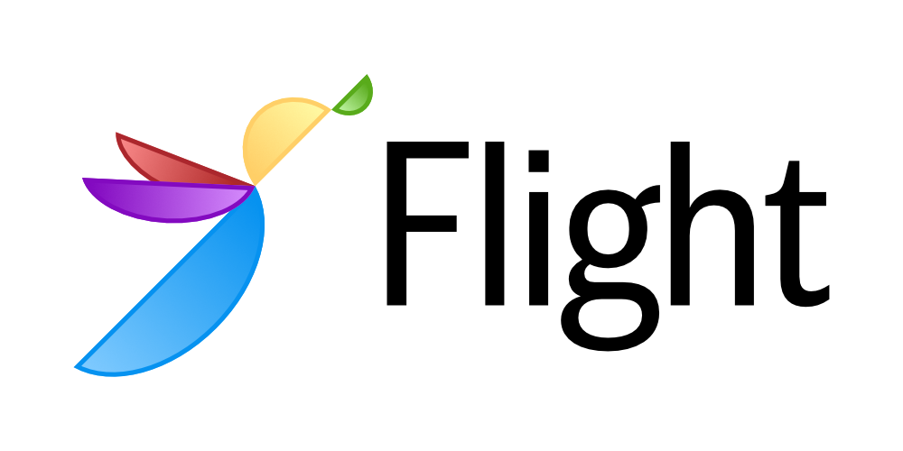

# Flight
Flight is a modular, easy-to-use federated learning framework built on top of Globus Compute, a federated Function-as-a-Service platform.

## Documentation
Documentation is currently being written and we hope to have them available online here soon.

## Citing Flight
If you use Flight for research or other purposes, we encourage you to cite the preprint:

```bibtex
@article{hudson2024flight,
  title={Flight: A FaaS-based framework for complex and hierarchical federated learning},
  author={Hudson, Nathaniel and Hayot-Sasson, Valerie and Babuji, Yadu and Baughman, Matt and Pauloski, J Gregory and Chard, Ryan and Foster, Ian and Chard, Kyle},
  journal={arXiv preprint arXiv:2409.16495},
  year={2024}
}
```


If relevant, the FLoX paper (for which Flight is a successor of) can be cited with the following BibTex:


```bibtex
@inproceedings{kotsehub2022flox,
  title={{FLoX}: Federated learning with {FaaS} at the edge},
  author={Kotsehub, Nikita and Baughman, Matt and Chard, Ryan and Hudson, Nathaniel and Patros, Panos and Rana, Omer and Foster, Ian and Chard, Kyle},
  booktitle={2022 IEEE 18th International Conference on e-Science (e-Science)},
  pages={11--20},
  year={2022},
  organization={IEEE}
}
```
